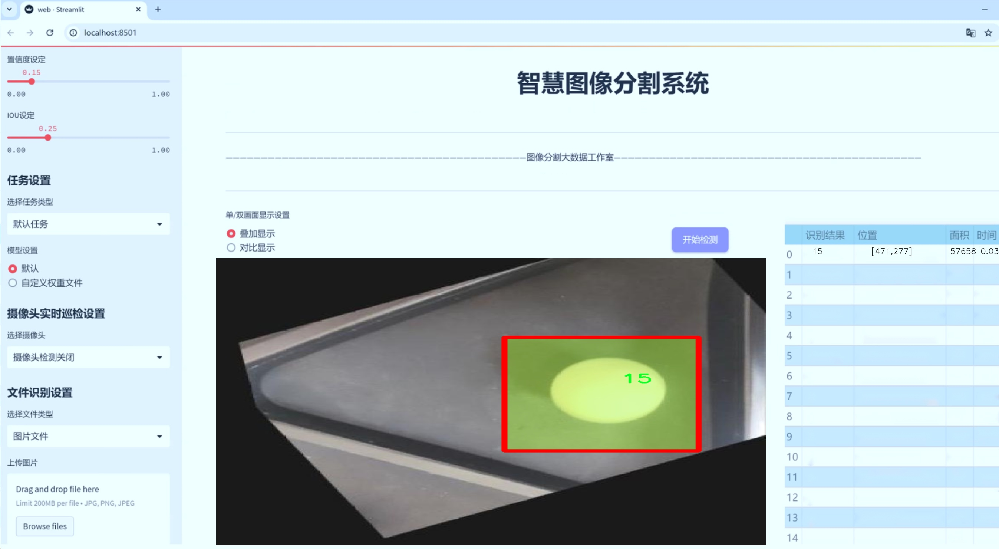
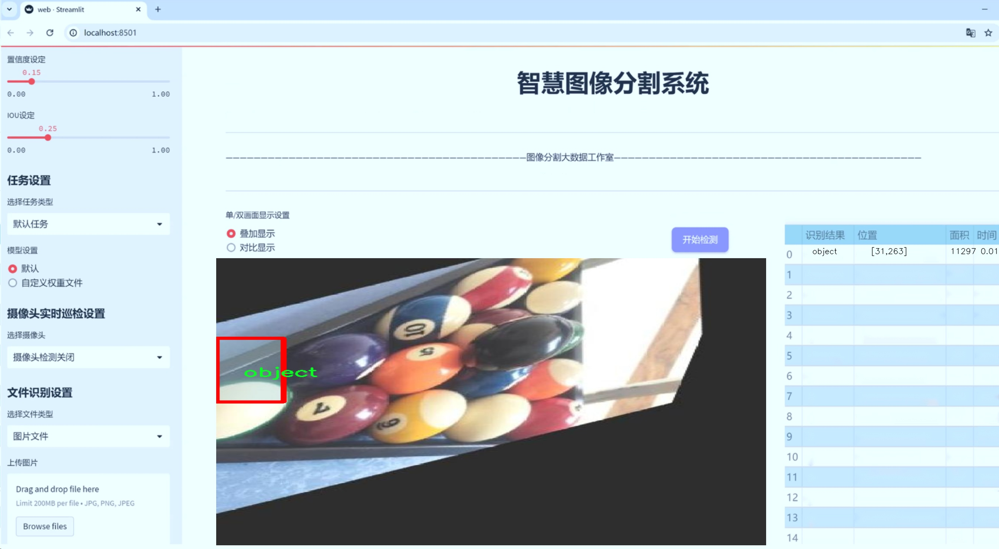
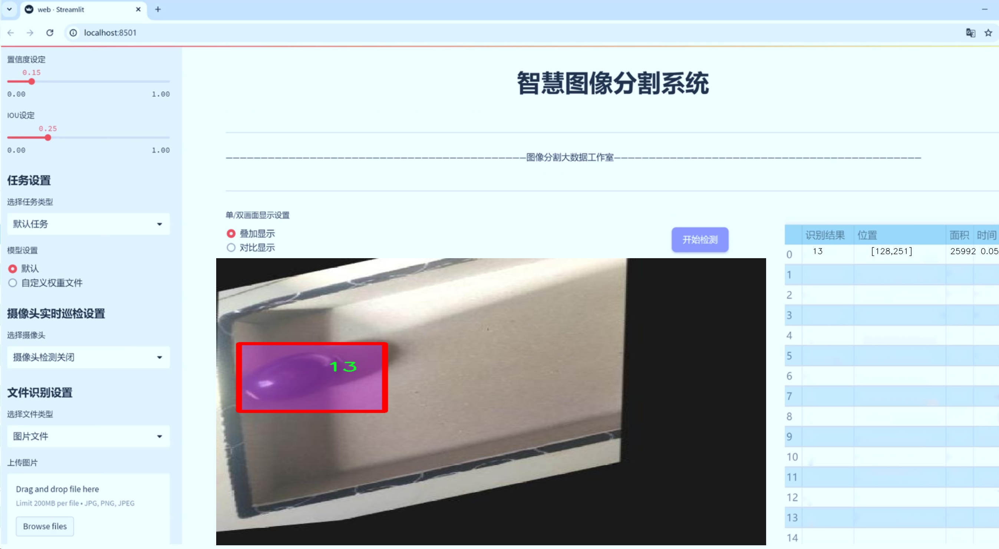
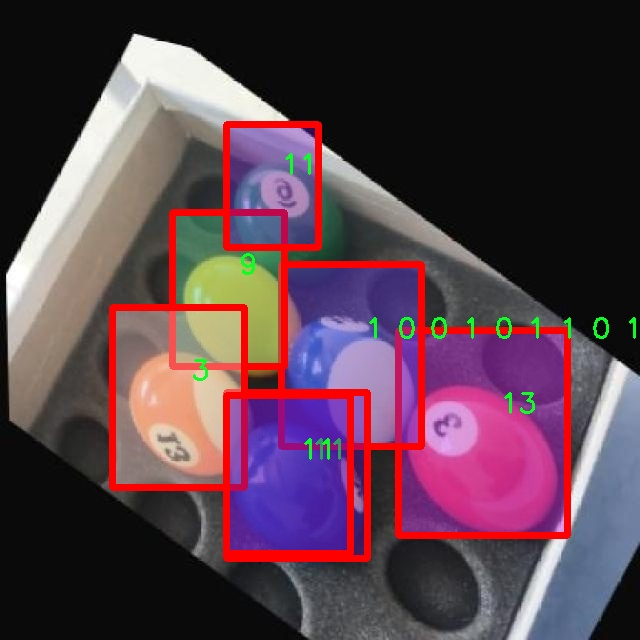
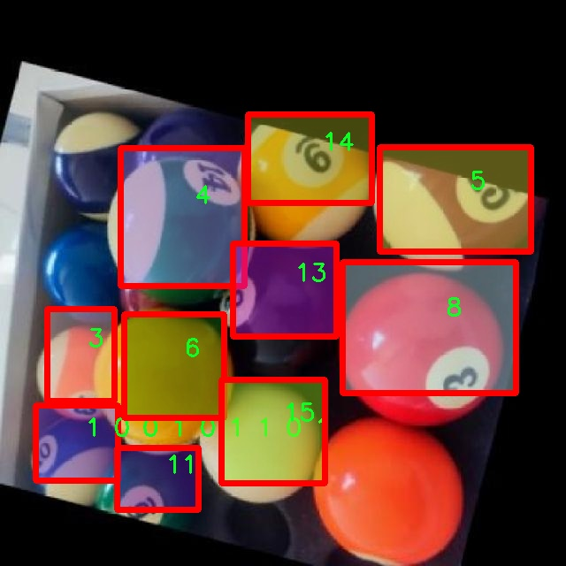
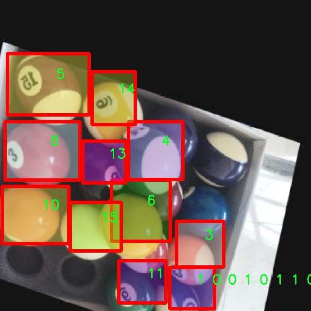
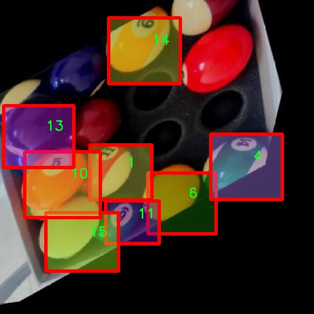
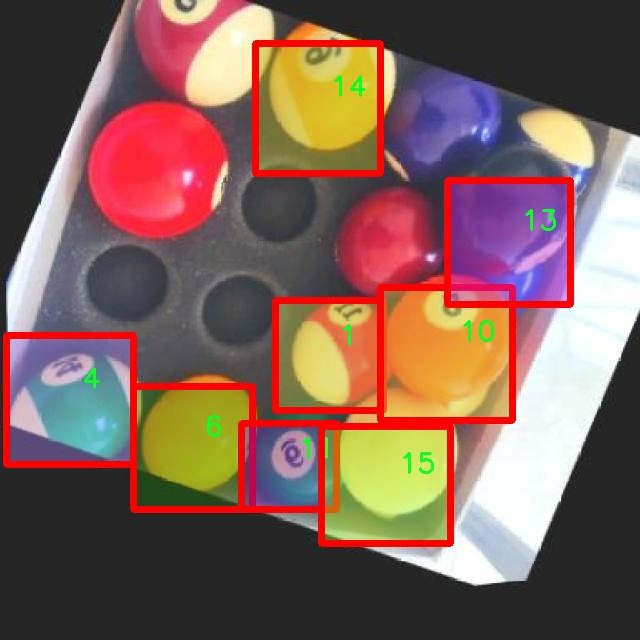

# 台球球体分割系统源码＆数据集分享
 [yolov8-seg-dyhead＆yolov8-seg-CSwinTransformer等50+全套改进创新点发刊_一键训练教程_Web前端展示]

### 1.研究背景与意义

项目参考[ILSVRC ImageNet Large Scale Visual Recognition Challenge](https://gitee.com/YOLOv8_YOLOv11_Segmentation_Studio/projects)

项目来源[AAAI Global Al lnnovation Contest](https://kdocs.cn/l/cszuIiCKVNis)

研究背景与意义

随着计算机视觉技术的迅猛发展，物体检测与分割在多个领域中得到了广泛应用，尤其是在体育分析、智能监控和自动驾驶等场景中。台球作为一项集技巧与策略于一体的运动，其比赛过程中的数据分析与实时监控对于提高比赛水平和观众体验具有重要意义。传统的台球分析方法多依赖于人工观察和记录，不仅效率低下，而且容易受到主观因素的影响。因此，基于深度学习的自动化分析系统应运而生，成为提升台球比赛分析效率和准确性的有效手段。

在众多深度学习模型中，YOLO（You Only Look Once）系列因其高效的实时检测能力而受到广泛关注。YOLOv8作为该系列的最新版本，进一步提升了检测精度和速度，尤其在复杂场景下的表现更为出色。然而，现有的YOLOv8模型在特定应用场景下仍存在一些不足，尤其是在细粒度物体分割任务中。台球比赛中，球体的分割与识别不仅需要高精度的定位，还需要对球体的形状、颜色等特征进行准确提取，以便于后续的轨迹分析和策略制定。因此，改进YOLOv8以适应台球球体分割的需求，具有重要的研究价值和实际意义。

本研究旨在基于改进的YOLOv8模型，构建一个高效的台球球体分割系统。为此，我们将利用“Pool1”数据集，该数据集包含3000张图像和17个类别，涵盖了台球比赛中可能出现的各种情况。通过对该数据集的深入分析与处理，我们将能够为模型的训练提供丰富的样本数据，从而提升模型在台球球体分割任务中的表现。此外，数据集中包含的多样化场景和不同光照条件，将为模型的鲁棒性和泛化能力提供良好的训练基础。

在技术层面，本研究将探讨如何通过改进YOLOv8的网络结构和训练策略，优化模型在台球球体分割任务中的表现。我们将引入先进的图像增强技术和数据预处理方法，以提高模型对不同环境下球体的识别能力。同时，针对台球球体的特征，我们将设计特定的损失函数，以提高模型对球体边缘和细节的关注度，从而实现更为精确的分割效果。

综上所述，基于改进YOLOv8的台球球体分割系统的研究，不仅为台球比赛的智能分析提供了新的技术手段，也为计算机视觉领域的实例分割任务提供了新的思路与方法。通过这一研究，我们期望能够推动台球运动的智能化发展，同时为相关领域的研究提供借鉴与参考。

### 2.图片演示







##### 注意：由于此博客编辑较早，上面“2.图片演示”和“3.视频演示”展示的系统图片或者视频可能为老版本，新版本在老版本的基础上升级如下：（实际效果以升级的新版本为准）

  （1）适配了YOLOV8的“目标检测”模型和“实例分割”模型，通过加载相应的权重（.pt）文件即可自适应加载模型。

  （2）支持“图片识别”、“视频识别”、“摄像头实时识别”三种识别模式。

  （3）支持“图片识别”、“视频识别”、“摄像头实时识别”三种识别结果保存导出，解决手动导出（容易卡顿出现爆内存）存在的问题，识别完自动保存结果并导出到tempDir中。

  （4）支持Web前端系统中的标题、背景图等自定义修改，后面提供修改教程。

  另外本项目提供训练的数据集和训练教程,暂不提供权重文件（best.pt）,需要您按照教程进行训练后实现图片演示和Web前端界面演示的效果。

### 3.视频演示

[3.1 视频演示](https://www.bilibili.com/video/BV13ZmTYPEnE/)

### 4.数据集信息展示

##### 4.1 本项目数据集详细数据（类别数＆类别名）

nc: 17
names: ['1', '1 0 0 1 0 1 1 0 1', '10', '11', '12', '13', '14', '15', '2', '3', '4', '5', '6', '7', '8', '9', 'object']


##### 4.2 本项目数据集信息介绍

数据集信息展示

在本研究中，我们使用了名为“Pool1”的数据集，以训练和改进YOLOv8-seg模型，旨在实现高效的台球球体分割系统。该数据集的设计考虑到了台球运动的多样性和复杂性，包含了17个不同的类别，这些类别不仅涵盖了台球的基本元素，还考虑到了不同球体的颜色和标识特征。具体而言，数据集中的类别包括数字化的球体标识，如“1”、“2”、“3”等，以及更复杂的组合标识如“1 0 0 1 0 1 1 0 1”，这些类别的设置为模型提供了丰富的学习样本，使其能够在多种场景下进行准确的分割和识别。

“Pool1”数据集的多样性在于其包含了台球运动中常见的所有球体，从而为模型的训练提供了广泛的样本。这些类别不仅仅是简单的数字标识，它们还代表了不同的台球种类及其在游戏中的重要性。例如，数字“1”通常代表的是台球中的“白球”，而数字“8”则是游戏中的关键球体，玩家的目标往往是将其打入袋中。通过对这些不同类别的标注，数据集为模型提供了丰富的上下文信息，使其能够更好地理解台球运动的规则和策略。

在数据集的构建过程中，研究团队注重了样本的多样性和代表性，确保每个类别都有足够的样本量以供模型进行有效的学习。这种精心设计的数据集不仅提高了模型的泛化能力，还增强了其在实际应用中的表现。为了确保数据集的质量，所有样本都经过严格的标注和审核，确保每个球体的边界清晰且准确。这种高质量的标注对于训练一个高效的分割模型至关重要，因为它直接影响到模型在实际应用中的性能。

此外，数据集还考虑到了不同光照条件和背景环境对模型训练的影响。通过在多种环境下采集样本，数据集增强了模型的鲁棒性，使其能够在不同的场景中保持良好的识别能力。这种多样化的训练数据不仅有助于提高模型的准确性，还能使其在面对未见过的场景时，依然能够做出合理的判断。

总之，“Pool1”数据集为改进YOLOv8-seg的台球球体分割系统提供了一个坚实的基础。通过丰富的类别设置和高质量的样本标注，该数据集不仅增强了模型的学习能力，还为未来的研究和应用提供了广阔的空间。随着台球运动的普及和相关技术的发展，基于“Pool1”数据集的研究将为智能台球系统的实现奠定重要的基础，推动相关领域的进一步发展。











### 5.全套项目环境部署视频教程（零基础手把手教学）

[5.1 环境部署教程链接（零基础手把手教学）](https://www.bilibili.com/video/BV1jG4Ve4E9t/?vd_source=bc9aec86d164b67a7004b996143742dc)


[5.2 安装Python虚拟环境创建和依赖库安装视频教程链接（零基础手把手教学）](https://www.bilibili.com/video/BV1nA4VeYEze/?vd_source=bc9aec86d164b67a7004b996143742dc)

### 6.手把手YOLOV8-seg训练视频教程（零基础小白有手就能学会）

[6.1 手把手YOLOV8-seg训练视频教程（零基础小白有手就能学会）](https://www.bilibili.com/video/BV1cA4VeYETe/?vd_source=bc9aec86d164b67a7004b996143742dc)


按照上面的训练视频教程链接加载项目提供的数据集，运行train.py即可开始训练



     Epoch   gpu_mem       box       obj       cls    labels  img_size
     1/200     0G   0.01576   0.01955  0.007536        22      1280: 100%|██████████| 849/849 [14:42<00:00,  1.04s/it]
               Class     Images     Labels          P          R     mAP@.5 mAP@.5:.95: 100%|██████████| 213/213 [01:14<00:00,  2.87it/s]
                 all       3395      17314      0.994      0.957      0.0957      0.0843

     Epoch   gpu_mem       box       obj       cls    labels  img_size
     2/200     0G   0.01578   0.01923  0.007006        22      1280: 100%|██████████| 849/849 [14:44<00:00,  1.04s/it]
               Class     Images     Labels          P          R     mAP@.5 mAP@.5:.95: 100%|██████████| 213/213 [01:12<00:00,  2.95it/s]
                 all       3395      17314      0.996      0.956      0.0957      0.0845

     Epoch   gpu_mem       box       obj       cls    labels  img_size
     3/200     0G   0.01561    0.0191  0.006895        27      1280: 100%|██████████| 849/849 [10:56<00:00,  1.29it/s]
               Class     Images     Labels          P          R     mAP@.5 mAP@.5:.95: 100%|███████   | 187/213 [00:52<00:00,  4.04it/s]
                 all       3395      17314      0.996      0.957      0.0957      0.0845


### 7.50+种全套YOLOV8-seg创新点代码加载调参视频教程（一键加载写好的改进模型的配置文件）

[7.1 50+种全套YOLOV8-seg创新点代码加载调参视频教程（一键加载写好的改进模型的配置文件）](https://www.bilibili.com/video/BV1Hw4VePEXv/?vd_source=bc9aec86d164b67a7004b996143742dc)

### 8.YOLOV8-seg图像分割算法原理

原始YOLOv8-seg算法原理

YOLOv8-seg算法作为YOLO系列的最新进展，继承并扩展了前代模型的设计理念，特别是在目标检测和分割任务中的应用。该算法的架构依然遵循YOLO系列的经典结构，包括输入层、主干网络、特征融合层（Neck）和解耦头（Head），但在每个模块中都融入了新的技术和改进，以提高检测精度和效率。

在主干网络部分，YOLOv8-seg采用了CSPDarknet的思想，利用C2f模块替代了YOLOv5中的C3模块。这一变化不仅使得模型在保持轻量化的同时，依然能够实现高精度的目标检测，还通过引入ELAN思想增强了特征的梯度流。C2f模块由多个CBS（卷积+批归一化+SiLU激活函数）模块和瓶颈结构组成，允许更深层次的特征提取和信息传递。通过这种设计，YOLOv8-seg能够在深层网络中有效缓解梯度消失和梯度爆炸的问题，提升模型的收敛速度和效果。

特征融合层（Neck）采用了PAN-FPN结构，进一步增强了多尺度特征的融合能力。YOLOv8-seg通过自下而上的方式将高层特征与中层和浅层特征进行融合，确保不同尺度的信息能够充分交互。这一过程通过C2f模块的并行分支设计，使得浅层特征的细节信息与高层特征的语义信息得以有效结合，从而提升了目标检测的准确性和鲁棒性。融合后的特征图被传递到解耦头进行后续的目标检测和分割任务。

在解耦头部分，YOLOv8-seg引入了Anchor-Free的思想，摒弃了传统的Anchor-Base方法。解耦头通过两个并行的卷积分支分别处理分类和回归任务，使得模型在进行目标检测时更加灵活和高效。分类分支采用了BCELoss进行二分类任务，而回归分支则使用了Distribution Focal Loss和CIoULoss的组合，以提高对小目标和难以识别样本的检测能力。通过这种方式，YOLOv8-seg能够在处理复杂场景时，保持较高的检测精度和较低的误检率。

在损失函数的设计上，YOLOv8-seg引入了VFLLoss作为分类损失，DFLLoss和CIoULoss作为回归损失。这一组合不仅能够有效应对样本不平衡的问题，还能够提高模型对困难样本的关注度，从而进一步提升检测性能。通过对损失函数的精细调整，YOLOv8-seg在训练过程中能够更好地适应不同类型的目标，尤其是在处理小目标和复杂背景时，表现出色。

在数据预处理方面，YOLOv8-seg延续了YOLOv5的策略，采用了马赛克增强、混合增强、空间扰动和颜色扰动等多种数据增强手段，以提升模型的泛化能力和鲁棒性。尽管在某些实验中未启用数据预处理，YOLOv8-seg依然展现出了强大的性能，这得益于其精心设计的网络结构和优化策略。

YOLOv8-seg的网络结构还包括了快速空间金字塔池化（SPPF）模块，该模块通过多个最大池化层处理多尺度特征，进一步增强了网络的特征抽象能力。这一设计使得YOLOv8-seg在处理不同尺度的目标时，能够保持较高的检测精度，并有效避免了因尺度差异导致的特征丢失。

总的来说，YOLOv8-seg算法在目标检测和分割任务中，通过对主干网络、特征融合层和解耦头的优化设计，充分利用了多尺度特征的信息，提升了模型的检测能力和鲁棒性。其创新的Anchor-Free设计和精细的损失函数组合，使得YOLOv8-seg在面对复杂场景时，依然能够保持高效的检测性能。这些改进不仅使得YOLOv8-seg在目标检测领域达到了新的高度，也为未来的研究和应用提供了新的思路和方向。


### 9.系统功能展示（检测对象为举例，实际内容以本项目数据集为准）

图9.1.系统支持检测结果表格显示

  图9.2.系统支持置信度和IOU阈值手动调节

  图9.3.系统支持自定义加载权重文件best.pt(需要你通过步骤5中训练获得)

  图9.4.系统支持摄像头实时识别

  图9.5.系统支持图片识别

  图9.6.系统支持视频识别

  图9.7.系统支持识别结果文件自动保存

  图9.8.系统支持Excel导出检测结果数据


### 10.50+种全套YOLOV8-seg创新点原理讲解（非科班也可以轻松写刊发刊，V11版本正在科研待更新）

#### 10.1 由于篇幅限制，每个创新点的具体原理讲解就不一一展开，具体见下列网址中的创新点对应子项目的技术原理博客网址【Blog】：


[10.1 50+种全套YOLOV8-seg创新点原理讲解链接](https://gitee.com/qunmasj/good)

#### 10.2 部分改进模块原理讲解(完整的改进原理见上图和技术博客链接)【如果此小节的图加载失败可以通过CSDN或者Github搜索该博客的标题访问原始博客，原始博客图片显示正常】

### YOLOv8简介
YOLOv8是一种目标检测模型，是基于YOLO (You Only Look Once)系列算法发展而来的最新版本。它的核心思想是将目标检测任务转化为一个回归问题，通过单次前向传播即可直接预测出图像中的多个目标的位置和类别。
YOLOv8的网络结构采用了Darknet作为其主干网络，主要由卷积层和池化层构成。与之前的版本相比，YOLOv8在网络结构上进行了改进，引入了更多的卷积层和残差模块，以提高模型的准确性和鲁棒性。
YOLOv8采用了一种特征金字塔网络(Feature Pyramid Network,FPN)的结构，通过在不同层级上融合多尺度的特征信息，可以对不同尺度的目标进行有效的检测。此外，YOLOv8还引入了一种自适应感知域(Adaptive Anchors
的机制，通过自适应地学习目标的尺度和
长宽比，提高了模型对于不同尺度和形状目标的检测效果。
总体来说，YOLOv8结构模型综合了多个先进的目标检测技术，在保证检测速度的同时提升了检测精度和鲁棒性，被广泛应用于实时目标检测任务中。


#### yolov8网络模型结构图

YOLOv8 (You Only Look Once version 8)是一种目标检测算法，它在实时场景下可以快速准确地检测图像中的目标。
YOLOv8的网络模型结构基于Darknet框架，由一系列卷积层、池化层和全连接层组成。主要包含以下几个组件:
1.输入层:接收输入图像。
2.卷积层:使用不同尺寸的卷积核来提取图像特征。
3.残差块(Residual blocks):通过使用跳跃连接(skip connections）来解决梯度消失问题，使得网络更容易训练。
4.上采样层(Upsample layers):通过插值操作将特征图的尺寸放大，以便在不同尺度上进行目标检测。
5.池化层:用于减小特征图的尺寸，同时保留重要的特征。
6.1x1卷积层:用于降低通道数，减少网络参数量。
7.3x3卷积层:用于进—步提取和组合特征。
8.全连接层:用于最后的目标分类和定位。
YOLOv8的网络结构采用了多个不同尺度的特征图来检测不同大小的目标，从而提高了目标检测的准确性和多尺度性能。
请注意，YOLOv8网络模型结构图的具体细节可能因YOLO版本和实现方式而有所不同。


#### yolov8模型结构
YOLOv8模型是一种目标检测模型，其结构是基于YOLOv3模型进行改进的。模型结构可以分为主干网络和检测头两个部分。
主干网络是一种由Darknet-53构成的卷积神经网络。Darknet-53是一个经过多层卷积和残差连接构建起来的深度神经网络。它能够提取图像的特征信息，并将这些信息传递给检测头。
检测头是YOLOv8的关键部分，它负责在图像中定位和识别目标。检测头由一系列卷积层和全连接层组成。在每个检测头中，会生成一组锚框，并针对每个锚框预测目标的类别和位置信息。
YOLOv8模型使用了预训练的权重，其中在COCO数据集上进行了训练。这意味着该模型已经通过大规模数据集的学习，具有一定的目标检测能力。

### RT-DETR骨干网络HGNetv2简介
#### RT-DETR横空出世
前几天被百度的RT-DETR刷屏，参考该博客提出的目标检测新范式对原始DETR的网络结构进行了调整和优化，以提高计算速度和减小模型大小。这包括使用更轻量级的基础网络和调整Transformer结构。并且，摒弃了nms处理的detr结构与传统的物体检测方法相比，不仅训练是端到端的，检测也能端到端，这意味着整个网络在训练过程中一起进行优化，推理过程不需要昂贵的后处理代价，这有助于提高模型的泛化能力和性能。


当然，人们对RT-DETR之所以产生浓厚的兴趣，我觉得大概率还是对YOLO系列审美疲劳了，就算是出到了YOLO10086，我还是只想用YOLOv5和YOLOv7的框架来魔改做业务。。

#### 初识HGNet
看到RT-DETR的性能指标，发现指标最好的两个模型backbone都是用的HGNetv2，毫无疑问，和当时的picodet一样，骨干都是使用百度自家的网络。初识HGNet的时候，当时是参加了第四届百度网盘图像处理大赛，文档图像方向识别专题赛道，简单来说，就是使用分类网络对一些文档截图或者图片进行方向角度分类。


当时的方案并没有那么快定型，通常是打榜过程发现哪个网络性能好就使用哪个网络做魔改，而且木有显卡，只能蹭Ai Studio的平台，不过v100一天8小时的实验时间有点短，这也注定了大模型用不了。 

流水的模型，铁打的炼丹人，最后发现HGNet-tiny各方面指标都很符合我们的预期，后面就一直围绕它魔改。当然，比赛打榜是目的，学习才是享受过程，当时看到效果还可以，便开始折腾起了HGNet的网络架构，我们可以看到，PP-HGNet 针对 GPU 设备，对目前 GPU 友好的网络做了分析和归纳，尽可能多的使用 3x3 标准卷积（计算密度最高），PP-HGNet是由多个HG-Block组成，细节如下：


ConvBNAct是啥？简单聊一聊，就是Conv+BN+Act，CV Man应该最熟悉不过了：
```python
class ConvBNAct(TheseusLayer):
    def __init__(self,
                 in_channels,
                 out_channels,
                 kernel_size,
                 stride,
                 groups=1,
                 use_act=True):
        super().__init__()
        self.use_act = use_act
        self.conv = Conv2D(
            in_channels,
            out_channels,
            kernel_size,
            stride,
            padding=(kernel_size - 1) // 2,
            groups=groups,
            bias_attr=False)
        self.bn = BatchNorm2D(
            out_channels,
            weight_attr=ParamAttr(regularizer=L2Decay(0.0)),
            bias_attr=ParamAttr(regularizer=L2Decay(0.0)))
        if self.use_act:
            self.act = ReLU()
 
    def forward(self, x):
        x = self.conv(x)
        x = self.bn(x)
        if self.use_act:
            x = self.act(x)
        return x 
```
且标准卷积的数量随层数深度增加而增多，从而得到一个有利于 GPU 推理的骨干网络，同样速度下，精度也超越其他 CNN ，性价比也优于ViT-base模型。


另外，我们可以看到：

PP-HGNet 的第一层由channel为96的Stem模块构成，目的是为了减少参数量和计算量。PP-HGNet

Tiny的整体结构由四个HG Stage构成，而每个HG Stage主要由包含大量标准卷积的HG Block构成。

PP-HGNet的第三到第五层使用了使用了可学习的下采样层（LDS Layer），该层group为输入通道数，可达到降参降计算量的作用，且Tiny模型仅包含三个LDS Layer，并不会对GPU的利用率造成较大影响.

PP-HGNet的激活函数为Relu，常数级操作可保证该模型在硬件上的推理速度。

### 11.项目核心源码讲解（再也不用担心看不懂代码逻辑）

#### 11.1 demo_test_video.py

以下是对代码的逐文件分析，保留了最核心的部分，并添加了详细的中文注释：

```python
import cv2
import numpy as np
from PIL import ImageFont, ImageDraw, Image
from hashlib import md5
from model import Web_Detector
from chinese_name_list import Label_list

def generate_color_based_on_name(name):
    # 使用哈希函数生成稳定的颜色
    hash_object = md5(name.encode())  # 对名字进行MD5哈希
    hex_color = hash_object.hexdigest()[:6]  # 取前6位16进制数
    r, g, b = int(hex_color[0:2], 16), int(hex_color[2:4], 16), int(hex_color[4:6], 16)  # 转换为RGB
    return (b, g, r)  # OpenCV 使用BGR格式

def draw_with_chinese(image, text, position, font_size=20, color=(255, 0, 0)):
    # 在图像上绘制中文文本
    image_pil = Image.fromarray(cv2.cvtColor(image, cv2.COLOR_BGR2RGB))  # 转换为PIL格式
    draw = ImageDraw.Draw(image_pil)  # 创建绘图对象
    font = ImageFont.truetype("simsun.ttc", font_size, encoding="unic")  # 加载中文字体
    draw.text(position, text, font=font, fill=color)  # 绘制文本
    return cv2.cvtColor(np.array(image_pil), cv2.COLOR_RGB2BGR)  # 转换回OpenCV格式

def draw_detections(image, info):
    # 绘制检测结果，包括边框、类别名称等
    name, bbox = info['class_name'], info['bbox']  # 获取类别名称和边界框
    x1, y1, x2, y2 = bbox  # 解包边界框坐标
    cv2.rectangle(image, (x1, y1), (x2, y2), color=(0, 0, 255), thickness=3)  # 绘制边界框
    image = draw_with_chinese(image, name, (x1, y1 - 10), font_size=20)  # 绘制类别名称
    return image

def process_frame(model, image):
    # 处理每一帧图像，进行目标检测
    pre_img = model.preprocess(image)  # 预处理图像
    pred = model.predict(pre_img)  # 进行预测
    det = pred[0]  # 获取检测结果

    if det is not None and len(det):
        det_info = model.postprocess(pred)  # 后处理获取检测信息
        for info in det_info:
            image = draw_detections(image, info)  # 绘制检测结果
    return image

if __name__ == "__main__":
    model = Web_Detector()  # 初始化模型
    model.load_model("./weights/yolov8s-seg.pt")  # 加载模型权重

    # 视频处理
    video_path = ''  # 输入视频路径
    cap = cv2.VideoCapture(video_path)  # 打开视频文件
    while cap.isOpened():
        ret, frame = cap.read()  # 逐帧读取视频
        if not ret:
            break
        processed_frame = process_frame(model, frame)  # 处理当前帧
        cv2.imshow('Processed Video', processed_frame)  # 显示处理后的视频
        if cv2.waitKey(1) & 0xFF == ord('q'):  # 按'q'退出
            break
    cap.release()  # 释放视频捕获对象
    cv2.destroyAllWindows()  # 关闭所有OpenCV窗口
```

### 代码核心部分说明：
1. **生成颜色**：`generate_color_based_on_name` 函数使用MD5哈希生成与名称相关的颜色，以确保相同名称总是生成相同颜色。
2. **绘制中文文本**：`draw_with_chinese` 函数使用PIL库在图像上绘制中文文本，支持中文字体。
3. **绘制检测结果**：`draw_detections` 函数根据检测信息在图像上绘制边界框和类别名称。
4. **处理视频帧**：`process_frame` 函数负责对每一帧进行预处理、预测和后处理，最终返回处理后的图像。
5. **主程序**：在主程序中，加载模型并逐帧处理视频，显示处理结果。

这些核心部分构成了整个目标检测系统的基础，确保了模型能够有效地处理视频并显示检测结果。

这个程序文件 `demo_test_video.py` 是一个用于视频处理的 Python 脚本，主要功能是使用深度学习模型对视频中的物体进行检测和分割，并在视频帧上绘制检测结果。

首先，程序导入了一些必要的库，包括 `random`、`cv2`（OpenCV）、`numpy`、`PIL`（用于处理图像的库）、`hashlib`（用于生成哈希值）、以及自定义的 `Web_Detector` 模型和 `Label_list`。这些库为后续的图像处理和模型推理提供了支持。

接下来，定义了几个辅助函数。`generate_color_based_on_name` 函数通过对输入的名称进行哈希处理，生成一个稳定的颜色值，这样每个物体类别都有一个固定的颜色。`calculate_polygon_area` 函数则用于计算多边形的面积，利用 OpenCV 的 `contourArea` 方法实现。

`draw_with_chinese` 函数负责在图像上绘制中文文本。它使用 PIL 库将 OpenCV 图像转换为 PIL 图像，然后在指定位置绘制文本，最后再转换回 OpenCV 格式。`adjust_parameter` 函数根据图像的大小调整参数，以便在不同分辨率下保持绘制的一致性。

`draw_detections` 函数是核心绘制函数，它接收图像和检测信息，绘制边界框、类别名称、面积、周长、圆度和颜色值等信息。如果检测到的物体有掩膜（mask），则会绘制多边形并计算相关的几何特征。这个函数通过调整参数来适应不同的图像大小，从而确保绘制效果的一致性。

`process_frame` 函数负责处理每一帧图像。它首先对图像进行预处理，然后使用模型进行预测，最后将检测到的物体信息传递给 `draw_detections` 函数进行绘制。

在主程序部分，首先加载类别名称和模型，然后打开视频文件进行逐帧处理。在循环中，读取每一帧并调用 `process_frame` 进行处理，最后通过 OpenCV 显示处理后的结果。如果用户按下 'q' 键，程序将退出。

总体来说，这个程序通过深度学习模型对视频中的物体进行检测，并在视频上实时显示检测结果，适用于物体检测和分割的应用场景。

#### 11.2 ultralytics\models\sam\modules\__init__.py

当然可以！以下是代码的核心部分，并附上详细的中文注释：

```python
# Ultralytics YOLO 🚀, AGPL-3.0 license

# 这是Ultralytics YOLO模型的开源代码，遵循AGPL-3.0许可证

# 下面是YOLO模型的主要实现部分
class YOLO:
    def __init__(self, model_path):
        # 初始化YOLO模型
        # model_path: 模型文件的路径
        self.model = self.load_model(model_path)

    def load_model(self, model_path):
        # 加载YOLO模型
        # 这里可以添加代码来加载预训练的模型
        pass

    def predict(self, image):
        # 对输入的图像进行预测
        # image: 输入的图像数据
        # 返回预测结果
        pass

    def draw_boxes(self, image, boxes):
        # 在图像上绘制检测到的边界框
        # image: 输入的图像数据
        # boxes: 检测到的边界框列表
        pass
```

### 代码注释说明：

1. **类定义**：
   - `class YOLO`: 定义了一个YOLO类，用于实现YOLO模型的功能。

2. **初始化方法**：
   - `def __init__(self, model_path)`: 构造函数，用于初始化YOLO模型。接收一个参数`model_path`，表示模型文件的路径。
   - `self.model = self.load_model(model_path)`: 调用`load_model`方法加载模型，并将其赋值给实例变量`self.model`。

3. **加载模型方法**：
   - `def load_model(self, model_path)`: 定义了一个方法用于加载YOLO模型。具体的加载实现可以在这里进行。

4. **预测方法**：
   - `def predict(self, image)`: 定义了一个方法用于对输入图像进行预测。参数`image`表示输入的图像数据，返回预测结果。

5. **绘制边界框方法**：
   - `def draw_boxes(self, image, boxes)`: 定义了一个方法用于在图像上绘制检测到的边界框。参数`image`表示输入的图像数据，`boxes`是检测到的边界框列表。

以上是代码的核心部分和详细注释，帮助理解YOLO模型的基本结构和功能。

这个文件是Ultralytics YOLO项目的一部分，具体位于`ultralytics/models/sam/modules/__init__.py`。根据文件名和路径可以推测，这个文件是一个模块的初始化文件，通常用于定义模块的公共接口或导入相关的子模块。

文件的开头有一行注释，标明了项目的名称“Ultralytics YOLO”，并且提到了该项目使用的是AGPL-3.0许可证。这意味着该项目是开源的，用户可以自由使用、修改和分发，但需要遵循相应的许可证条款。

虽然具体的代码内容没有给出，但通常在`__init__.py`文件中，开发者会导入该模块下的其他类、函数或变量，以便用户在导入这个模块时能够直接访问这些功能。这种做法可以提高代码的可读性和可维护性，使得模块的使用更加方便。

总的来说，这个文件在Ultralytics YOLO项目中起到了模块初始化和公共接口定义的作用，帮助用户更好地使用该项目的功能。

#### 11.3 ui.py

以下是经过简化并注释的核心代码部分：

```python
import sys
import subprocess

def run_script(script_path):
    """
    使用当前 Python 环境运行指定的脚本。

    Args:
        script_path (str): 要运行的脚本路径

    Returns:
        None
    """
    # 获取当前 Python 解释器的路径
    python_path = sys.executable

    # 构建运行命令，使用 streamlit 运行指定的脚本
    command = f'"{python_path}" -m streamlit run "{script_path}"'

    # 执行命令并等待其完成
    result = subprocess.run(command, shell=True)
    
    # 检查命令执行结果，如果返回码不为0，则表示出错
    if result.returncode != 0:
        print("脚本运行出错。")

# 程序入口
if __name__ == "__main__":
    # 指定要运行的脚本路径
    script_path = "web.py"  # 这里可以直接指定脚本名，假设在当前目录下

    # 调用函数运行脚本
    run_script(script_path)
```

### 代码注释说明：
1. **导入模块**：
   - `sys`：用于获取当前 Python 解释器的路径。
   - `subprocess`：用于执行外部命令。

2. **`run_script` 函数**：
   - 定义了一个函数，接受一个参数 `script_path`，表示要运行的脚本路径。
   - 使用 `sys.executable` 获取当前 Python 解释器的路径。
   - 构建一个命令字符串，使用 `streamlit` 运行指定的脚本。
   - 使用 `subprocess.run` 执行构建的命令，并等待其完成。
   - 检查命令的返回码，如果不为0，表示脚本运行出错，打印错误信息。

3. **程序入口**：
   - 使用 `if __name__ == "__main__":` 确保代码只在直接运行时执行。
   - 指定要运行的脚本路径，这里假设脚本 `web.py` 在当前目录下。
   - 调用 `run_script` 函数来执行指定的脚本。

这个程序文件的主要功能是使用当前的 Python 环境来运行一个指定的脚本，具体来说是一个名为 `web.py` 的脚本。程序首先导入了必要的模块，包括 `sys`、`os` 和 `subprocess`，这些模块分别用于系统相关的操作、文件路径处理和执行外部命令。

在 `run_script` 函数中，首先获取当前 Python 解释器的路径，这通过 `sys.executable` 实现。接着，构建一个命令字符串，这个命令会调用 `streamlit` 模块来运行指定的脚本。命令的格式是将 Python 解释器的路径与 `-m streamlit run` 和脚本路径组合在一起。

随后，使用 `subprocess.run` 方法执行这个命令。这个方法会在一个新的 shell 中运行命令，并返回一个结果对象。通过检查 `result.returncode`，程序可以判断脚本是否成功运行。如果返回码不为零，表示脚本运行过程中出现了错误，此时会输出一条错误信息。

在文件的最后部分，使用 `if __name__ == "__main__":` 来确保只有在直接运行该文件时才会执行下面的代码。这里指定了要运行的脚本路径，即 `web.py`，并调用 `run_script` 函数来执行这个脚本。

整体来看，这个程序是一个简单的脚本启动器，旨在方便地通过当前的 Python 环境来运行一个 Streamlit 应用。

#### 11.4 ultralytics\utils\instance.py

以下是经过简化和注释的核心代码部分，主要包含 `Bboxes` 和 `Instances` 类的实现。注释详细解释了每个方法和属性的功能。

```python
import numpy as np

class Bboxes:
    """
    处理边界框的类，支持多种格式（'xyxy', 'xywh', 'ltwh'）。
    属性:
        bboxes (numpy.ndarray): 存储边界框的二维数组。
        format (str): 边界框的格式（'xyxy', 'xywh', 或 'ltwh'）。
    """

    def __init__(self, bboxes, format='xyxy') -> None:
        """初始化 Bboxes 类，设置边界框数据和格式。"""
        assert format in ['xyxy', 'xywh', 'ltwh'], f'无效的边界框格式: {format}'
        bboxes = bboxes[None, :] if bboxes.ndim == 1 else bboxes  # 确保 bboxes 是二维数组
        assert bboxes.ndim == 2 and bboxes.shape[1] == 4, '边界框数据必须是二维数组，且每个框包含4个值'
        self.bboxes = bboxes
        self.format = format

    def convert(self, format):
        """将边界框格式转换为指定类型。"""
        assert format in ['xyxy', 'xywh', 'ltwh'], f'无效的边界框格式: {format}'
        if self.format == format:
            return  # 如果格式相同，不做任何转换
        # 根据当前格式和目标格式选择转换函数
        func = {
            'xyxy': {'xywh': xyxy2xywh, 'ltwh': xyxy2ltwh},
            'xywh': {'xyxy': xywh2xyxy, 'ltwh': xywh2ltwh},
            'ltwh': {'xyxy': ltwh2xyxy, 'xywh': ltwh2xywh}
        }[self.format][format]
        self.bboxes = func(self.bboxes)  # 执行转换
        self.format = format  # 更新格式

    def areas(self):
        """返回每个边界框的面积。"""
        self.convert('xyxy')  # 确保转换为 'xyxy' 格式
        return (self.bboxes[:, 2] - self.bboxes[:, 0]) * (self.bboxes[:, 3] - self.bboxes[:, 1])  # 计算面积

    def __len__(self):
        """返回边界框的数量。"""
        return len(self.bboxes)

class Instances:
    """
    存储图像中检测到的对象的边界框、分段和关键点的容器。
    属性:
        _bboxes (Bboxes): 内部对象，用于处理边界框操作。
        keypoints (ndarray): 关键点数据，形状为 [N, 17, 3]。
        segments (ndarray): 分段数组，形状为 [N, 1000, 2]。
    """

    def __init__(self, bboxes, segments=None, keypoints=None, bbox_format='xywh', normalized=True) -> None:
        """初始化 Instances 类，设置边界框、分段和关键点数据。"""
        self._bboxes = Bboxes(bboxes=bboxes, format=bbox_format)  # 初始化边界框
        self.keypoints = keypoints  # 设置关键点
        self.normalized = normalized  # 设置是否归一化

        # 处理分段数据
        if segments is None:
            segments = []
        if len(segments) > 0:
            segments = resample_segments(segments)  # 重采样分段
            segments = np.stack(segments, axis=0)  # 堆叠为三维数组
        else:
            segments = np.zeros((0, 1000, 2), dtype=np.float32)  # 如果没有分段，初始化为空数组
        self.segments = segments

    def convert_bbox(self, format):
        """转换边界框格式。"""
        self._bboxes.convert(format=format)

    @property
    def bbox_areas(self):
        """计算边界框的面积。"""
        return self._bboxes.areas()

    def __getitem__(self, index) -> 'Instances':
        """
        使用索引检索特定实例或一组实例。
        返回:
            Instances: 包含选定边界框、分段和关键点的新 Instances 对象。
        """
        segments = self.segments[index] if len(self.segments) else self.segments
        keypoints = self.keypoints[index] if self.keypoints is not None else None
        bboxes = self._bboxes[index]
        bbox_format = self._bboxes.format
        return Instances(
            bboxes=bboxes,
            segments=segments,
            keypoints=keypoints,
            bbox_format=bbox_format,
            normalized=self.normalized,
        )

    def __len__(self):
        """返回实例的数量。"""
        return len(self._bboxes)
```

### 主要功能概述：
- **Bboxes 类**：用于处理边界框，支持格式转换和面积计算。
- **Instances 类**：用于存储和处理检测到的对象的边界框、分段和关键点，提供格式转换和索引功能。

这个程序文件是一个用于处理边界框（bounding boxes）的工具类，主要用于计算机视觉任务中，特别是在目标检测领域。文件中定义了两个主要的类：`Bboxes`和`Instances`，它们分别用于处理边界框和图像中检测到的对象的实例。

首先，`Bboxes`类负责管理边界框。它支持多种边界框格式，包括`xyxy`（左上角和右下角坐标）、`xywh`（中心坐标和宽高）以及`ltwh`（左上角坐标和宽高）。在初始化时，`Bboxes`类会检查输入的边界框格式是否有效，并确保输入的边界框数据是一个二维的NumPy数组，且每个边界框包含四个值。

`Bboxes`类提供了多种方法，包括格式转换、计算面积、缩放、添加偏移量等。通过`convert`方法，可以将边界框从一种格式转换为另一种格式。`areas`方法计算每个边界框的面积。`mul`和`add`方法分别用于对边界框的坐标进行缩放和添加偏移。

`Instances`类则是一个更高级的容器，除了包含边界框外，还可以存储对象的分割信息和关键点。它的构造函数接收边界框、分割和关键点数据，并对分割数据进行重采样处理。`Instances`类也提供了多种方法，包括格式转换、缩放、归一化和去归一化等。

此外，`Instances`类还实现了翻转、裁剪和去除零面积框的功能。通过`clip`方法，可以确保边界框和分割信息保持在图像边界内。`remove_zero_area_boxes`方法则会移除那些在裁剪后变为零宽度或零高度的边界框。

两个类都实现了索引功能，可以通过索引来获取特定的边界框或实例。此外，`Bboxes`和`Instances`类都提供了一个`concatenate`类方法，用于将多个对象合并为一个对象。

总的来说，这个文件提供了一套完整的工具，用于处理目标检测中的边界框、分割和关键点数据，方便后续的图像处理和分析。

#### 11.5 ultralytics\models\sam\modules\sam.py

以下是代码中最核心的部分，并附上详细的中文注释：

```python
import torch
from torch import nn
from typing import List

class Sam(nn.Module):
    """
    Sam (Segment Anything Model) 是一个用于对象分割任务的模型。它使用图像编码器生成图像嵌入，并使用提示编码器对各种类型的输入提示进行编码。这些嵌入随后被掩码解码器用于预测对象掩码。
    """

    # 掩码预测的阈值
    mask_threshold: float = 0.0
    # 输入图像的格式，默认为 'RGB'
    image_format: str = 'RGB'

    def __init__(
        self,
        image_encoder: ImageEncoderViT,  # 图像编码器，用于将图像编码为嵌入
        prompt_encoder: PromptEncoder,    # 提示编码器，用于编码输入提示
        mask_decoder: MaskDecoder,        # 掩码解码器，用于从图像嵌入和编码的提示中预测掩码
        pixel_mean: List[float] = (123.675, 116.28, 103.53),  # 图像归一化的均值
        pixel_std: List[float] = (58.395, 57.12, 57.375)       # 图像归一化的标准差
    ) -> None:
        """
        初始化 Sam 类，以从图像和输入提示中预测对象掩码。

        参数:
            image_encoder (ImageEncoderViT): 用于将图像编码为图像嵌入的主干网络。
            prompt_encoder (PromptEncoder): 编码各种类型的输入提示。
            mask_decoder (MaskDecoder): 从图像嵌入和编码的提示中预测掩码。
            pixel_mean (List[float], optional): 用于归一化输入图像的均值，默认为 (123.675, 116.28, 103.53)。
            pixel_std (List[float], optional): 用于归一化输入图像的标准差，默认为 (58.395, 57.12, 57.375)。
        """
        super().__init__()  # 调用父类 nn.Module 的初始化方法
        self.image_encoder = image_encoder  # 初始化图像编码器
        self.prompt_encoder = prompt_encoder  # 初始化提示编码器
        self.mask_decoder = mask_decoder  # 初始化掩码解码器
        # 注册均值和标准差为缓冲区，用于图像归一化
        self.register_buffer('pixel_mean', torch.Tensor(pixel_mean).view(-1, 1, 1), False)
        self.register_buffer('pixel_std', torch.Tensor(pixel_std).view(-1, 1, 1), False)
```

### 代码核心部分说明：
1. **类定义**：`Sam`类继承自`nn.Module`，用于实现对象分割模型。
2. **属性**：
   - `mask_threshold`：用于设置掩码预测的阈值。
   - `image_format`：定义输入图像的格式。
3. **初始化方法**：
   - 接收图像编码器、提示编码器和掩码解码器作为参数，分别用于处理图像和提示信息。
   - `pixel_mean`和`pixel_std`用于图像的归一化处理，确保输入数据的均值和标准差适合模型训练。
4. **缓冲区注册**：使用`register_buffer`方法将均值和标准差注册为模型的缓冲区，这样在模型保存和加载时也会保留这些信息。

这个程序文件定义了一个名为 `Sam` 的类，属于 Ultralytics YOLO 项目的一部分，主要用于对象分割任务。该类继承自 PyTorch 的 `nn.Module`，这是构建神经网络模型的基础类。

在 `Sam` 类中，首先定义了一些属性，包括 `mask_threshold` 和 `image_format`，分别用于设置掩膜预测的阈值和输入图像的格式（默认为 RGB）。此外，还定义了三个主要的组件：`image_encoder`、`prompt_encoder` 和 `mask_decoder`，它们分别用于将图像编码为嵌入、对输入提示进行编码以及根据图像和提示的嵌入预测对象掩膜。

在类的初始化方法 `__init__` 中，接收了三个参数：`image_encoder`、`prompt_encoder` 和 `mask_decoder`，这些参数分别对应于图像编码器、提示编码器和掩膜解码器的实例。初始化时，还可以选择性地传入用于图像归一化的均值和标准差，默认值分别为 `(123.675, 116.28, 103.53)` 和 `(58.395, 57.12, 57.375)`。

在初始化过程中，调用了父类的构造函数，并将传入的编码器和解码器赋值给相应的属性。同时，使用 `register_buffer` 方法注册了图像归一化所需的均值和标准差，这样它们会被包含在模型的状态字典中，但不会被视为模型的可学习参数。

总体而言，这个类的设计旨在通过组合不同的编码器和解码器，提供一个灵活的框架，用于处理图像分割任务。通过将图像和提示信息进行编码，最终生成对应的对象掩膜，从而实现高效的分割效果。

#### 11.6 train.py

以下是经过简化和注释的核心代码部分：

```python
import os
import torch
import yaml
from ultralytics import YOLO  # 导入YOLO模型

if __name__ == '__main__':  # 确保该模块被直接运行时才执行以下代码
    # 设置训练参数
    workers = 1  # 数据加载的工作进程数
    batch = 8  # 每个批次的样本数量
    device = "0" if torch.cuda.is_available() else "cpu"  # 选择设备，优先使用GPU

    # 获取数据集的yaml配置文件的绝对路径
    data_path = abs_path(f'datasets/data/data.yaml', path_type='current')  

    # 将路径转换为Unix风格
    unix_style_path = data_path.replace(os.sep, '/')
    # 获取目录路径
    directory_path = os.path.dirname(unix_style_path)

    # 读取YAML文件，保持原有顺序
    with open(data_path, 'r') as file:
        data = yaml.load(file, Loader=yaml.FullLoader)

    # 修改YAML文件中的路径项
    if 'train' in data and 'val' in data and 'test' in data:
        data['train'] = directory_path + '/train'  # 设置训练集路径
        data['val'] = directory_path + '/val'      # 设置验证集路径
        data['test'] = directory_path + '/test'    # 设置测试集路径

        # 将修改后的数据写回YAML文件
        with open(data_path, 'w') as file:
            yaml.safe_dump(data, file, sort_keys=False)

    # 加载YOLO模型配置文件和预训练权重
    model = YOLO(r"C:\codeseg\codenew\50+种YOLOv8算法改进源码大全和调试加载训练教程（非必要）\改进YOLOv8模型配置文件\yolov8-seg-C2f-Faster.yaml").load("./weights/yolov8s-seg.pt")

    # 开始训练模型
    results = model.train(
        data=data_path,  # 指定训练数据的配置文件路径
        device=device,  # 使用指定的设备进行训练
        workers=workers,  # 使用的工作进程数
        imgsz=640,  # 输入图像的大小为640x640
        epochs=100,  # 训练100个epoch
        batch=batch,  # 每个批次的大小
    )
```

### 代码注释说明：
1. **导入必要的库**：导入操作系统、PyTorch、YAML解析库和YOLO模型。
2. **主程序入口**：使用`if __name__ == '__main__':`确保只有在直接运行该脚本时才执行后续代码。
3. **设置训练参数**：定义数据加载的工作进程数、批次大小和设备选择（GPU或CPU）。
4. **获取数据集路径**：通过`abs_path`函数获取数据集配置文件的绝对路径，并转换为Unix风格的路径。
5. **读取和修改YAML文件**：读取YAML文件，修改训练、验证和测试集的路径，并将修改后的内容写回文件。
6. **加载YOLO模型**：指定模型配置文件和预训练权重，加载YOLO模型。
7. **开始训练模型**：调用`model.train`方法进行模型训练，传入训练数据路径、设备、工作进程数、图像大小、训练轮数和批次大小等参数。

这个程序文件 `train.py` 是用于训练 YOLO（You Only Look Once）模型的脚本，主要功能是加载数据集、配置模型并开始训练。程序的执行流程如下：

首先，程序导入了必要的库，包括 `os`、`torch`、`yaml` 和 `ultralytics` 中的 YOLO 模型。接着，设置了 matplotlib 的后端为 TkAgg，以便于图形显示。

在 `if __name__ == '__main__':` 语句下，确保该模块被直接运行时才执行以下代码。首先定义了一些训练参数，包括工作进程数 `workers` 和批次大小 `batch`，并根据是否有可用的 GPU 设备来设置训练设备 `device`。如果有可用的 GPU，则使用 GPU（设备编号为 "0"），否则使用 CPU。

接下来，程序通过 `abs_path` 函数获取数据集配置文件 `data.yaml` 的绝对路径，并将其转换为 UNIX 风格的路径。然后，使用 `os.path.dirname` 获取该路径的目录部分。

程序读取 YAML 文件中的数据，使用 `yaml.load` 方法保持原有顺序。接着检查 YAML 文件中是否包含 `train`、`val` 和 `test` 三个字段，如果存在，则将这些字段的路径修改为相对于当前目录的路径，并将修改后的数据写回到 YAML 文件中，确保路径正确。

在模型加载部分，程序创建了一个 YOLO 模型实例，指定了模型的配置文件路径，并加载了预训练的权重文件。此处的配置文件和权重文件路径是硬编码的，用户可以根据需要进行修改。

最后，程序调用 `model.train` 方法开始训练模型，传入了训练数据的配置文件路径、设备、工作进程数、输入图像大小、训练的 epoch 数量和批次大小等参数。这些参数决定了训练过程的具体设置。

总的来说，这个脚本提供了一个简单的框架，用于设置和训练 YOLO 模型，适合用于目标检测和图像分割等任务。用户可以根据自己的需求调整参数和配置文件。

### 12.系统整体结构（节选）

### 整体功能和构架概括

该项目是一个基于 Ultralytics YOLO 框架的计算机视觉应用，主要用于目标检测和图像分割任务。项目的整体架构由多个模块和文件组成，每个文件负责特定的功能。以下是项目的主要功能和构架概述：

1. **视频处理**：`demo_test_video.py` 文件用于处理视频流，执行目标检测并在视频帧上绘制检测结果。
2. **模型和模块初始化**：`ultralytics/models/sam/modules/__init__.py` 文件用于初始化模型模块，导入相关的子模块。
3. **用户界面**：`ui.py` 文件用于启动一个 Streamlit 应用，提供用户交互界面。
4. **边界框处理**：`ultralytics/utils/instance.py` 文件提供了边界框和实例管理的工具类，支持多种操作，如格式转换、面积计算等。
5. **模型定义**：`ultralytics/models/sam/modules/sam.py` 文件定义了一个用于对象分割的模型类，整合了图像编码器、提示编码器和掩膜解码器。
6. **模型训练**：`train.py` 文件用于设置和训练 YOLO 模型，加载数据集和配置，并启动训练过程。
7. **回调和日志**：其他文件（如 `clearml.py`、`log.py`、`hub.py`）用于实现训练过程中的回调功能和日志记录。
8. **额外模块**：`kernel_warehouse.py` 和其他初始化文件用于定义额外的模块和功能，支持项目的扩展性和可维护性。
9. **跟踪功能**：`ultralytics/trackers/track.py` 文件实现了目标跟踪的功能，进一步增强了目标检测的应用场景。

### 文件功能整理表

| 文件路径                                             | 功能描述                                                                 |
|-----------------------------------------------------|--------------------------------------------------------------------------|
| `demo_test_video.py`                               | 处理视频流，执行目标检测并绘制检测结果。                                 |
| `ultralytics/models/sam/modules/__init__.py`      | 初始化模型模块，导入相关子模块。                                        |
| `ui.py`                                            | 启动 Streamlit 应用，提供用户交互界面。                                   |
| `ultralytics/utils/instance.py`                    | 提供边界框和实例管理的工具类，支持格式转换、面积计算等操作。             |
| `ultralytics/models/sam/modules/sam.py`           | 定义对象分割模型类，整合图像编码器、提示编码器和掩膜解码器。             |
| `train.py`                                         | 设置和训练 YOLO 模型，加载数据集和配置，启动训练过程。                   |
| `ultralytics/utils/callbacks/clearml.py`          | 实现 ClearML 的回调功能，用于监控和管理训练过程。                        |
| `log.py`                                           | 记录训练过程中的日志信息，便于调试和分析。                              |
| `ultralytics/nn/extra_modules/kernel_warehouse.py` | 定义额外的模块和功能，支持项目的扩展性和可维护性。                       |
| `__init__.py`                                      | 模块初始化文件，通常用于定义模块的公共接口。                             |
| `ultralytics/utils/callbacks/hub.py`              | 实现 Hub 的回调功能，支持模型的共享和管理。                              |
| `ultralytics/models/yolo/pose/__init__.py`        | 初始化 YOLO 相关的姿态估计模块。                                        |
| `ultralytics/trackers/track.py`                   | 实现目标跟踪功能，增强目标检测的应用场景。                               |

这个表格概述了项目中每个文件的主要功能，帮助理解项目的整体结构和各个组件之间的关系。

注意：由于此博客编辑较早，上面“11.项目核心源码讲解（再也不用担心看不懂代码逻辑）”中部分代码可能会优化升级，仅供参考学习，完整“训练源码”、“Web前端界面”和“50+种创新点源码”以“14.完整训练+Web前端界面+50+种创新点源码、数据集获取”的内容为准。

### 13.图片、视频、摄像头图像分割Demo(去除WebUI)代码

在这个博客小节中，我们将讨论如何在不使用WebUI的情况下，实现图像分割模型的使用。本项目代码已经优化整合，方便用户将分割功能嵌入自己的项目中。
核心功能包括图片、视频、摄像头图像的分割，ROI区域的轮廓提取、类别分类、周长计算、面积计算、圆度计算以及颜色提取等。
这些功能提供了良好的二次开发基础。

### 核心代码解读

以下是主要代码片段，我们会为每一块代码进行详细的批注解释：

```python
import random
import cv2
import numpy as np
from PIL import ImageFont, ImageDraw, Image
from hashlib import md5
from model import Web_Detector
from chinese_name_list import Label_list

# 根据名称生成颜色
def generate_color_based_on_name(name):
    ......

# 计算多边形面积
def calculate_polygon_area(points):
    return cv2.contourArea(points.astype(np.float32))

...
# 绘制中文标签
def draw_with_chinese(image, text, position, font_size=20, color=(255, 0, 0)):
    image_pil = Image.fromarray(cv2.cvtColor(image, cv2.COLOR_BGR2RGB))
    draw = ImageDraw.Draw(image_pil)
    font = ImageFont.truetype("simsun.ttc", font_size, encoding="unic")
    draw.text(position, text, font=font, fill=color)
    return cv2.cvtColor(np.array(image_pil), cv2.COLOR_RGB2BGR)

# 动态调整参数
def adjust_parameter(image_size, base_size=1000):
    max_size = max(image_size)
    return max_size / base_size

# 绘制检测结果
def draw_detections(image, info, alpha=0.2):
    name, bbox, conf, cls_id, mask = info['class_name'], info['bbox'], info['score'], info['class_id'], info['mask']
    adjust_param = adjust_parameter(image.shape[:2])
    spacing = int(20 * adjust_param)

    if mask is None:
        x1, y1, x2, y2 = bbox
        aim_frame_area = (x2 - x1) * (y2 - y1)
        cv2.rectangle(image, (x1, y1), (x2, y2), color=(0, 0, 255), thickness=int(3 * adjust_param))
        image = draw_with_chinese(image, name, (x1, y1 - int(30 * adjust_param)), font_size=int(35 * adjust_param))
        y_offset = int(50 * adjust_param)  # 类别名称上方绘制，其下方留出空间
    else:
        mask_points = np.concatenate(mask)
        aim_frame_area = calculate_polygon_area(mask_points)
        mask_color = generate_color_based_on_name(name)
        try:
            overlay = image.copy()
            cv2.fillPoly(overlay, [mask_points.astype(np.int32)], mask_color)
            image = cv2.addWeighted(overlay, 0.3, image, 0.7, 0)
            cv2.drawContours(image, [mask_points.astype(np.int32)], -1, (0, 0, 255), thickness=int(8 * adjust_param))

            # 计算面积、周长、圆度
            area = cv2.contourArea(mask_points.astype(np.int32))
            perimeter = cv2.arcLength(mask_points.astype(np.int32), True)
            ......

            # 计算色彩
            mask = np.zeros(image.shape[:2], dtype=np.uint8)
            cv2.drawContours(mask, [mask_points.astype(np.int32)], -1, 255, -1)
            color_points = cv2.findNonZero(mask)
            ......

            # 绘制类别名称
            x, y = np.min(mask_points, axis=0).astype(int)
            image = draw_with_chinese(image, name, (x, y - int(30 * adjust_param)), font_size=int(35 * adjust_param))
            y_offset = int(50 * adjust_param)

            # 绘制面积、周长、圆度和色彩值
            metrics = [("Area", area), ("Perimeter", perimeter), ("Circularity", circularity), ("Color", color_str)]
            for idx, (metric_name, metric_value) in enumerate(metrics):
                ......

    return image, aim_frame_area

# 处理每帧图像
def process_frame(model, image):
    pre_img = model.preprocess(image)
    pred = model.predict(pre_img)
    det = pred[0] if det is not None and len(det)
    if det:
        det_info = model.postprocess(pred)
        for info in det_info:
            image, _ = draw_detections(image, info)
    return image

if __name__ == "__main__":
    cls_name = Label_list
    model = Web_Detector()
    model.load_model("./weights/yolov8s-seg.pt")

    # 摄像头实时处理
    cap = cv2.VideoCapture(0)
    while cap.isOpened():
        ret, frame = cap.read()
        if not ret:
            break
        ......

    # 图片处理
    image_path = './icon/OIP.jpg'
    image = cv2.imread(image_path)
    if image is not None:
        processed_image = process_frame(model, image)
        ......

    # 视频处理
    video_path = ''  # 输入视频的路径
    cap = cv2.VideoCapture(video_path)
    while cap.isOpened():
        ret, frame = cap.read()
        ......
```


### 14.完整训练+Web前端界面+50+种创新点源码、数据集获取


# [下载链接：https://mbd.pub/o/bread/Zp2Yk5pw](https://mbd.pub/o/bread/Zp2Yk5pw)